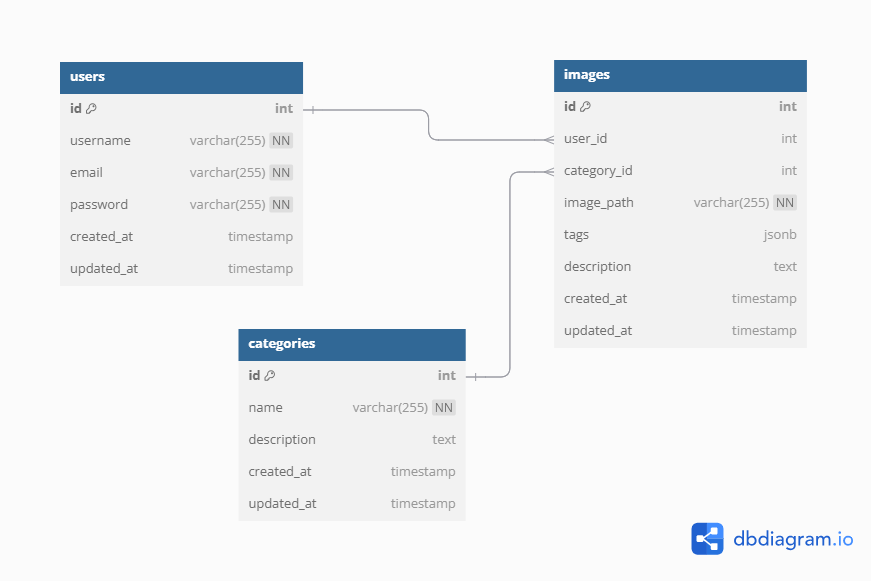

# AI-Powered Image Gallery

## Project Overview
**AI-Powered Image Gallery** is a dynamic web application that enhances image management by generating AI-based tags and descriptions for uploaded images. It allows users to explore, categorize, and organize their image collections with ease, while providing standard search functionality to locate images based on metadata.

## Features

### AI-Powered Tagging and Descriptions
- Automatically generates meaningful tags and descriptions for uploaded images using AI models.

### Image Upload and Categorization
- Users can upload images and categorize them into collections or groups.

### Manual and Automated Organization
- AI-generated tags assist in sorting images, while users can manually assign categories for better organization.

### Search Functionality
- Search through the gallery using metadata like tags and descriptions (**not AI-powered**).

### Dynamic Pages
- Includes pages like **Home**, **Gallery**, **Favorites**, **Trash**, **Add Image**, and **Image Detail** for seamless navigation and functionality.
## Tools to be Installed

Before running the project, ensure the following tools and dependencies are installed on your machine:

1. **Node.js**
   - Install Node.js (version >= 16.x) to run the backend server.
   - [Download from Node.js Official Website](https://nodejs.org/).

2. **MongoDB**
   - Install and configure MongoDB for the database.
   - [Refer to MongoDB Installation Guide](https://www.mongodb.com/docs/manual/installation/).

3. **NPM (Node Package Manager)**
   - Comes with Node.js and is used for installing dependencies like `express`, `mongoose`, `axios`, etc.

4. **React**
   - No manual installation required if using `create-react-app`. It will be automatically configured during the setup.

5. **Postman (Optional)**
   - For testing API endpoints during development.
   - [Download from Postman Website](https://www.postman.com/downloads/).

## Database

The project uses **MongoDB** as the database to store and manage data. Below are the three main collections and their schemas:

### 1. Images Collection
Stores details of the uploaded images, including their metadata and AI-generated tags/descriptions.

**Schema Fields:**
- `imagePath` (String, required): File path of the uploaded image.
- `name` (String, required): User-defined or auto-generated name for the image.
- `description` (String): AI-generated description of the image content.
- `tags` (Array of Strings): AI-generated tags for the image.
- `categoryId` (ObjectId, references `Category`): Links the image to a specific category.
- `userId` (ObjectId, references `User`): Identifies the user who uploaded the image.
- `isFavorite` (Boolean, default: false): Marks the image as a favorite.
- `isTrashed` (Boolean, default: false): Indicates whether the image is moved to the trash.

### 2. Categories Collection
Stores the categories into which images are organized.

**Schema Fields:**
- `name` (String, required): Name of the category.
- `userId` (ObjectId, references `User`): Identifies the user who created the category.

### 3. Users Collection
Stores user authentication details and preferences.

**Schema Fields:**
- `username` (String, required, unique): Unique identifier for the user.
- `password` (String, required): User's password (stored securely).

### Relationships Between Collections:
1. **Images** are linked to **Categories** via the `categoryId` field, allowing users to organize their images into groups.
2. **Images** and **Categories** are associated with a specific **User** through the `userId` field, ensuring that data is user-specific.

These schemas collectively ensure efficient data management and seamless functionality across the application.
## Installation

To get started with the project, follow these steps:

1. **Clone the repository:**

```bash
git clone <repository_url>  
cd <project_directory>
```
2. **Install dependencies for both frontend and backend:**
```bash
cd client  
npm install  

cd ../server  
npm install
```
3. **Set up environment variables:** Create a `.env` file in the root directory and add
4. **Start the development servers:**
In the client folder, run:
```bash
npm start
```
In the server folder, run:
```bash
npm run dev
```
5. **Access the application:** Open your web browser and navigate to `http://localhost:3000
## Future Enhancements

As the project evolves, several features and improvements can be added to enhance the user experience and functionality:

1. **AI-Powered Search:**
   - Implement AI-driven search functionality that allows users to search based on image content, not just metadata like tags and descriptions.
   - Enhance search results with more relevant suggestions based on image features.

2. **Image Editing:**
   - Add image editing capabilities such as cropping, resizing, and applying filters directly within the gallery.
   - Allow users to modify AI-generated descriptions and tags.

3. **User Authentication and Profiles:**
   - Integrate user authentication (login/signup) to enable personalized experiences, allowing users to save and manage their image galleries.
   - Add user profile features to track their image uploads, favorites, and preferences.

4. **AI Customization:**
   - Provide users with the ability to customize the AI models for generating tags and descriptions based on specific needs or preferences.
   - Allow users to train the AI on their own datasets to improve accuracy.

5. **Multi-Image Upload:**
   - Enable users to upload multiple images at once and automatically generate tags and descriptions for each one.
   - Provide progress bars and notifications to improve the user experience during bulk uploads.

6. **Advanced Sorting and Filtering:**
   - Implement advanced sorting options based on image attributes (e.g., upload date, file size, resolution) and AI-generated tags.
   - Add dynamic filters to help users find specific images quickly.

7. **Improved Mobile Experience:**
   - Optimize the UI and UX for mobile devices to make the application more responsive and user-friendly on smartphones and tablets.

8. **Integration with Cloud Storage:**
   - Allow users to upload and store images in cloud storage (e.g., AWS S3, Google Cloud Storage) to improve scalability and performance.

9. **AI-Generated Image Captions:**
   - Extend the AI capabilities to generate captions based on the image’s content, making it easier for users to understand and engage with the images.

10. **Collaboration Features:**
    - Allow multiple users to collaborate on image galleries, sharing images, tags, and descriptions in real time.

These enhancements aim to make the Image Gallery even more powerful, intuitive, and adaptable to users' needs.
## License

This project is licensed under the MIT License
